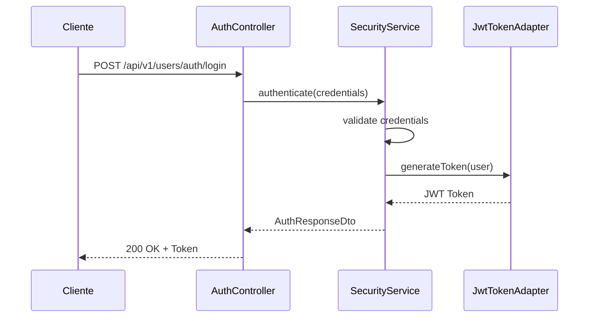
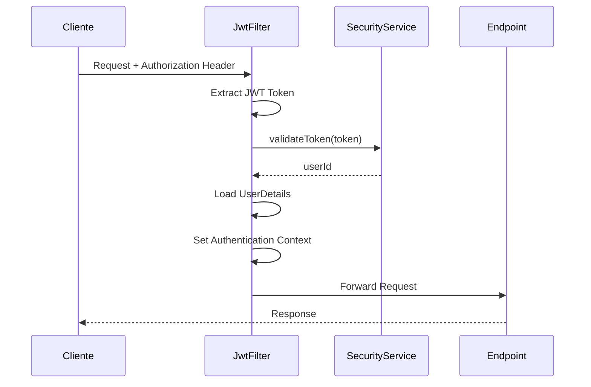

# 🔐 Arquitectura de Seguridad

## Descripción General
El módulo de seguridad de DevMatch implementa un sistema robusto de autenticación y autorización basado en JWT (JSON Web Tokens) y Spring Security. Proporciona control granular de acceso a los endpoints de la API.

## 🏗️ Componentes Principales

### 1. SecurityConfig.java
**Configuración central de seguridad de Spring Security**

#### Características:
- **Configuración de endpoints públicos** - Rutas que no requieren autenticación
- **Configuración de roles** - Control de acceso basado en roles (USER, ADMIN)
- **Configuración de JWT** - Integración con filtros de autenticación
- **Manejo de excepciones** - Handlers personalizados para errores de seguridad

#### Endpoints Públicos (Sin Autenticación):
```java
// Autenticación
"/api/v1/users/auth/register"
"/api/v1/users/auth/login"

// Swagger/OpenAPI
"/swagger-ui/**", "/swagger-ui.html"
"/v3/api-docs/**"
"/swagger-resources/**"
"/webjars/**"

// Health Check
"/actuator/health"
"/error"

// Notificaciones internas del sistema
"/api/v1/notifications/internal/**"

// Catálogos públicos
"/api/v1/projects/public/**"
"/api/v1/tags"
"/api/v1/tags/search/**"
"/api/v1/tags/by-type/**"
"/api/v1/achievements"
"/api/v1/achievements/*"
"/api/v1/achievements/code/*"
"/api/v1/achievements/type/*"

// Reviews públicas (solo lectura)
"/api/v1/reviews/project/**"
"/api/v1/reviews/*"
```

#### Endpoints que Requieren Autenticación:
```java
// Aplicaciones a proyectos
"/api/v1/project-applications/**"

// Perfil de usuario
"/api/v1/users/*/profile/**"
"/api/v1/users/profile/me"

// Logros del usuario
"/api/v1/users/me/achievements/**"

// Tipos de perfil
"/api/v1/users/profile/types/**"

// Tags de usuario
"/api/v1/tags/profile/**"

// Reviews (escritura)
"/api/v1/reviews"
```

#### Endpoints que Requieren Rol ADMIN:
```java
// Administración de usuarios
"/api/v1/users/*/admin/**"
"/api/v1/users/admin/search"
"/api/v1/users/admin/profile-types/**"
"/api/v1/users/admin/users/*/profile-types/**"

// Administración de roles
"/api/v1/roles/admin/**"

// Administración de tags
"/api/v1/tags/admin/**"

// Administración de achievements
"/api/admin/achievements/**"
"/api/admin/users/*/achievements/**"

// Administración de reviews
"/api/admin/reviews/**"
```

### 2. JwtAuthenticationFilter.java
**Filtro de autenticación JWT personalizado**

#### Flujo de Autenticación:
1. **Extracción del token** - Obtiene el token del header `Authorization`
2. **Validación del token** - Verifica la validez y extrae el userId
3. **Carga de detalles de usuario** - Obtiene información del usuario
4. **Establecimiento de autenticación** - Configura el contexto de seguridad

#### Características:
- **Filtro por request** - Se ejecuta una vez por petición
- **Manejo de errores** - Captura excepciones de validación
- **Debug logging** - Logs detallados para troubleshooting
- **Skip de rutas públicas** - Omite autenticación en rutas públicas

### 3. CustomUserDetailsService.java
**Servicio personalizado de detalles de usuario**

#### Funcionalidades:
- **Carga por ID** - Obtiene detalles de usuario por ID
- **Mapeo de roles** - Convierte roles de dominio a authorities de Spring
- **Integración con JWT** - Compatible con el sistema de tokens

### 4. Manejo de Excepciones de Seguridad

#### CustomAuthenticationEntryPoint
- **401 Unauthorized** - Cuando no hay token o es inválido
- **Respuesta estandarizada** - Formato consistente de error

#### CustomAccessDeniedHandler
- **403 Forbidden** - Cuando el usuario no tiene permisos
- **Mensaje descriptivo** - Explicación del error de acceso

## 🔑 Flujo de Autenticación

### 1. Login del Usuario


### 2. Acceso a Endpoint Protegido


## 🛡️ Configuración de Seguridad

### Configuración de Sesiones
```java
.sessionManagement(session -> session
    .sessionCreationPolicy(SessionCreationPolicy.STATELESS)
)
```
- **Stateless** - No mantiene sesiones en servidor
- **JWT-based** - Autenticación basada en tokens

### Configuración de CSRF
```java
.csrf(csrf -> csrf.disable())
```
- **Deshabilitado** - Para APIs REST stateless
- **JWT protection** - Los tokens JWT proporcionan protección

### Configuración de CORS
- **Configurado globalmente** - Para permitir requests desde frontend
- **Headers permitidos** - Authorization, Content-Type, etc.

## 🔒 Roles y Permisos

### Roles del Sistema
1. **USER** - Usuario autenticado básico
   - Acceso a su perfil
   - Gestión de sus proyectos
   - Aplicación a proyectos
   - Gestión de sus notificaciones

2. **ADMIN** - Administrador del sistema
   - Todos los permisos de USER
   - Gestión de usuarios
   - Gestión de roles
   - Gestión de tags
   - Gestión de achievements
   - Gestión de reviews

### Matriz de Permisos
| Recurso | USER | ADMIN |
|---------|------|-------|
| Perfil propio | ✅ | ✅ |
| Perfil de otros | ❌ | ✅ |
| Proyectos propios | ✅ | ✅ |
| Proyectos de otros | ❌ | ✅ |
| Aplicaciones | ✅ | ✅ |
| Reviews | ✅ | ✅ |
| Gestión de usuarios | ❌ | ✅ |
| Gestión de roles | ❌ | ✅ |
| Gestión de tags | ❌ | ✅ |
| Gestión de achievements | ❌ | ✅ |

## 🚨 Códigos de Error de Seguridad

| Código | Descripción | Causa |
|--------|-------------|-------|
| 401 | Unauthorized | Token faltante, inválido o expirado |
| 403 | Forbidden | Usuario autenticado pero sin permisos |
| 400 | Bad Request | Credenciales inválidas en login |

### Ejemplos de Respuestas de Error

#### 401 Unauthorized
```json
{
  "timestamp": "2024-01-15T10:30:00",
  "status": 401,
  "error": "Unauthorized",
  "message": "Token JWT inválido o expirado"
}
```

#### 403 Forbidden
```json
{
  "timestamp": "2024-01-15T10:30:00",
  "status": 403,
  "error": "Forbidden",
  "message": "No tienes permisos para realizar esta operación"
}
```

## 🔧 Configuración de JWT

### Propiedades del Token
- **Algoritmo**: HS256
- **Expiración**: 24 horas (configurable)
- **Issuer**: DevMatch API
- **Subject**: User ID

### Estructura del Token
```json
{
  "sub": "123",
  "iat": 1642248000,
  "exp": 1642334400,
  "role": "USER",
  "username": "usuario@ejemplo.com"
}
```

## 🧪 Testing de Seguridad

### Endpoints de Prueba
```bash
# Login exitoso
curl -X POST "http://localhost:8080/api/v1/users/auth/login" \
  -H "Content-Type: application/json" \
  -d '{"username": "usuario@ejemplo.com", "password": "password123"}'

# Acceso con token
curl -X GET "http://localhost:8080/api/v1/users/profile/me" \
  -H "Authorization: Bearer <token>"

# Acceso sin token (debe fallar)
curl -X GET "http://localhost:8080/api/v1/users/profile/me"

# Acceso con token inválido (debe fallar)
curl -X GET "http://localhost:8080/api/v1/users/profile/me" \
  -H "Authorization: Bearer token_invalido"
```

## 📝 Mejores Prácticas

### Para Desarrolladores
1. **Siempre validar tokens** - En endpoints protegidos
2. **Usar roles apropiados** - No otorgar permisos innecesarios
3. **Manejar errores gracefully** - Proporcionar mensajes claros
4. **Logging de seguridad** - Registrar intentos de acceso

### Para Administradores
1. **Rotar claves JWT** - Periódicamente
2. **Monitorear accesos** - Revisar logs de seguridad
3. **Auditar permisos** - Verificar asignación de roles
4. **Actualizar configuraciones** - Mantener seguridad actualizada

## 🔄 Flujo de Renovación de Tokens

### Estrategia Actual
- **Tokens de larga duración** - 24 horas de validez
- **Re-login requerido** - No hay refresh tokens
- **Logout implícito** - Token expira automáticamente

### Consideraciones Futuras
- **Refresh tokens** - Para renovación automática
- **Token revocation** - Para logout inmediato
- **Multi-sesión** - Gestión de múltiples dispositivos
