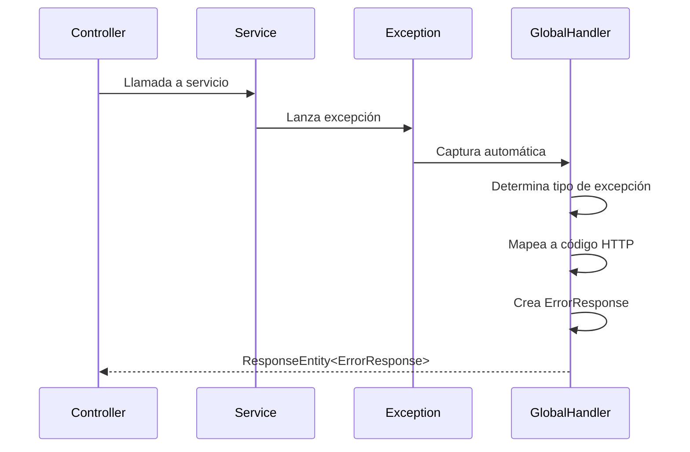
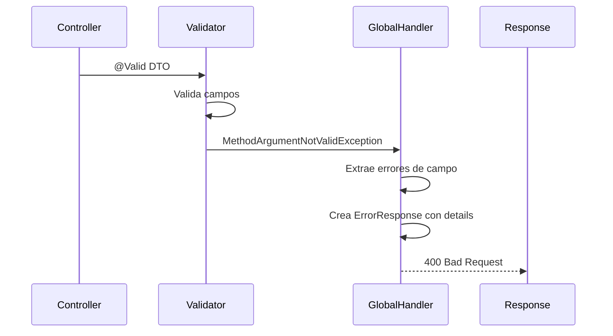

# 🔧 Arquitectura Compartida (Shared)

## Descripción General
El módulo `shared` contiene componentes transversales que son utilizados por todos los demás módulos de la aplicación. Proporciona funcionalidades base como configuración de OpenAPI, manejo global de excepciones, eventos de dominio y excepciones base del sistema.

## 🏗️ Componentes Principales

### 1. OpenApiConfig.java
**Configuración centralizada de OpenAPI 3.0 para Swagger UI**

#### Características:
- **Información de la API** - Título, descripción, versión
- **Configuración de servidores** - Desarrollo, staging, producción
- **Esquema de seguridad JWT** - Configuración de autenticación
- **Metadatos de contacto** - Información del equipo de desarrollo

#### Configuración de la API:
```java
.title("DevMatch API")
.description("Plataforma colaborativa para desarrolladores")
.version("1.0.0")
.contact(contactInfo())
.license(licenseInfo())
```

#### Servidores Configurados:
- **Desarrollo**: `http://localhost:8080`
- **Staging**: `https://api-dev.devmatch.com`
- **Producción**: `https://api.devmatch.com`

#### Esquema de Seguridad JWT:
```java
.type(SecurityScheme.Type.HTTP)
.scheme("bearer")
.bearerFormat("JWT")
.name("Authorization")
```

### 2. GlobalExceptionHandler.java
**Manejador global de excepciones para toda la aplicación**

#### Funcionalidades:
- **Captura centralizada** - Todas las excepciones no manejadas
- **Respuestas estandarizadas** - Formato consistente de errores
- **Códigos HTTP apropiados** - Mapeo correcto de excepciones
- **Logging estructurado** - Registro detallado de errores

#### Excepciones Manejadas:

##### Excepciones de Validación
- **MethodArgumentNotValidException** - Errores de validación de DTOs
- **IllegalArgumentException** - Argumentos ilegales

##### Excepciones de Recursos
- **UserNotFoundException** - Usuario no encontrado
- **ProjectNotFoundException** - Proyecto no encontrado
- **RoleNotFoundException** - Rol no encontrado
- **TagNotFoundException** - Tag no encontrado
- **AchievementNotFoundException** - Achievement no encontrado

##### Excepciones de Negocio
- **UserAlreadyExistsException** - Usuario ya existe
- **RoleAlreadyExistsException** - Rol ya existe
- **UserAlreadyHasAchievementException** - Usuario ya tiene achievement
- **ProfileTypeInUseException** - Tipo de perfil en uso
- **TagInUseException** - Tag en uso
- **RoleInUseException** - Rol en uso

##### Excepciones de Operaciones
- **UserOperationNotAllowedException** - Operación no permitida en usuario
- **ProjectOperationNotAllowedException** - Operación no permitida en proyecto
- **ReviewOperationNotAllowedException** - Operación no permitida en review
- **ProjectMessageOperationNotAllowedException** - Operación no permitida en mensaje

##### Excepciones de Límites
- **ProjectLimitExceededException** - Límite de proyectos excedido
- **ReviewLimitExceededException** - Límite de reviews excedido

##### Excepciones de Seguridad
- **AuthenticationException** - Error de autenticación
- **AccessDeniedException** - Acceso denegado

##### Excepciones de Base de Datos
- **DataIntegrityViolationException** - Violación de integridad de datos

#### Estructura de Respuesta de Error:
```json
{
  "timestamp": "2024-01-15T10:30:00",
  "status": 404,
  "error": "Usuario no encontrado",
  "message": "No se encontró el usuario con ID: 123",
  "details": {
    "field1": "Error específico del campo",
    "field2": "Otro error de validación"
  }
}
```

### 3. Excepciones del Dominio

#### ResourceNotFoundException.java
**Excepción base para recursos no encontrados**

```java
// Por ID
new ResourceNotFoundException("usuario", 123L)
// Resultado: "No se encontró el usuario con ID: 123"

// Por identificador
new ResourceNotFoundException("usuario", "email", "test@example.com")
// Resultado: "No se encontró el usuario con email: test@example.com"

// Mensaje personalizado
new ResourceNotFoundException("El usuario especificado no existe")
```

#### BusinessRuleViolationException.java
**Excepción para violaciones de reglas de negocio**

#### ValidationException.java
**Excepción para errores de validación de dominio**

### 4. Modelos Base del Dominio

#### BaseDomainEntity.java
**Entidad base para todas las entidades del dominio**

#### BaseDomainEvent.java
**Evento base para todos los eventos de dominio**

### 5. Sistema de Eventos

#### DomainEventPublisher.java (Port)
**Puerto para publicación de eventos de dominio**

#### SpringDomainEventPublisher.java (Adapter)
**Adaptador Spring para publicación de eventos**

## 🔄 Flujo de Manejo de Excepciones

### 1. Captura de Excepción


### 2. Procesamiento de Validación


## 📊 Códigos de Error Estándar

| Código | Descripción | Uso Típico |
|--------|-------------|------------|
| 400 | Bad Request | Validación de datos, argumentos ilegales |
| 401 | Unauthorized | Token faltante o inválido |
| 403 | Forbidden | Acceso denegado, operación no permitida |
| 404 | Not Found | Recurso no encontrado |
| 409 | Conflict | Recurso ya existe, límite excedido |
| 500 | Internal Server Error | Error inesperado del servidor |

## 🧪 Testing de Excepciones

### Ejemplos de Pruebas

#### Error de Validación
```bash
curl -X POST "http://localhost:8080/api/v1/users/auth/register" \
  -H "Content-Type: application/json" \
  -d '{"username": "", "password": "123"}'

# Respuesta esperada: 400 Bad Request
{
  "timestamp": "2024-01-15T10:30:00",
  "status": 400,
  "error": "Error de validación",
  "message": "Los datos proporcionados no son válidos",
  "details": {
    "username": "El nombre de usuario es requerido",
    "password": "La contraseña debe tener al menos 8 caracteres"
  }
}
```

#### Recurso No Encontrado
```bash
curl -X GET "http://localhost:8080/api/v1/users/999999"

# Respuesta esperada: 404 Not Found
{
  "timestamp": "2024-01-15T10:30:00",
  "status": 404,
  "error": "Usuario no encontrado",
  "message": "No se encontró el usuario con ID: 999999"
}
```

#### Acceso Denegado
```bash
curl -X GET "http://localhost:8080/api/v1/users/1/admin/profile-types"

# Respuesta esperada: 403 Forbidden
{
  "timestamp": "2024-01-15T10:30:00",
  "status": 403,
  "error": "Acceso denegado",
  "message": "No tienes permisos para realizar esta operación"
}
```

## 🔧 Configuración de OpenAPI

### Propiedades de la API
```yaml
title: DevMatch API
description: Plataforma colaborativa para desarrolladores
version: 1.0.0
contact:
  name: DevMatch Team
  email: devmatch@example.com
  url: https://devmatch.com
license:
  name: MIT License
  url: https://opensource.org/licenses/MIT
```

### Configuración de Swagger UI
```properties
# application.properties
springdoc.swagger-ui.path=/swagger-ui
springdoc.api-docs.path=/v3/api-docs
springdoc.swagger-ui.operationsSorter=method
springdoc.swagger-ui.tagsSorter=alpha
springdoc.swagger-ui.filter=true
springdoc.swagger-ui.display-request-duration=true
springdoc.swagger-ui.show-extensions=true
springdoc.swagger-ui.show-common-extensions=true
springdoc.swagger-ui.try-it-out-enabled=true
springdoc.swagger-ui.request-snippets-enabled=true
springdoc.swagger-ui.default-models-expand-depth=1
springdoc.swagger-ui.default-model-expand-depth=1
springdoc.swagger-ui.doc-expansion=none
springdoc.swagger-ui.validator-url=
```

## 📝 Mejores Prácticas

### Para Desarrolladores
1. **Usar excepciones específicas** - No usar Exception genérica
2. **Mensajes descriptivos** - Explicar claramente el error
3. **Códigos HTTP apropiados** - Usar el código correcto
4. **Logging estructurado** - Registrar errores con contexto

### Para el Sistema
1. **Manejo centralizado** - Todas las excepciones por GlobalHandler
2. **Respuestas consistentes** - Formato estándar de ErrorResponse
3. **Logging de errores** - Registro detallado para debugging
4. **Monitoreo** - Alertas para errores críticos

## 🔄 Eventos de Dominio

### Publicación de Eventos
```java
// En el dominio
domainEventPublisher.publish(new UserRegisteredEvent(userId, email));

// En el adaptador Spring
@EventListener
public void handleUserRegistered(UserRegisteredEvent event) {
    // Lógica de manejo del evento
}
```

### Tipos de Eventos
- **UserRegisteredEvent** - Usuario registrado
- **ProjectCreatedEvent** - Proyecto creado
- **AchievementUnlockedEvent** - Logro desbloqueado
- **ReviewSubmittedEvent** - Review enviada

## 🚀 Extensibilidad

### Agregar Nueva Excepción
1. **Crear excepción** en el módulo correspondiente
2. **Agregar handler** en GlobalExceptionHandler
3. **Mapear código HTTP** apropiado
4. **Documentar** en la API

### Agregar Nuevo Evento
1. **Crear evento** extendiendo BaseDomainEvent
2. **Implementar listener** en el adaptador
3. **Publicar evento** desde el dominio
4. **Testear** el flujo completo

## 📚 Referencias

### Documentación Spring
- [Spring Security](https://spring.io/projects/spring-security)
- [Spring Boot Validation](https://spring.io/guides/gs/validating-form-input/)
- [Spring Events](https://docs.spring.io/spring-framework/docs/current/reference/html/core.html#context-functionality-events)

### Estándares
- [HTTP Status Codes](https://developer.mozilla.org/en-US/docs/Web/HTTP/Status)
- [OpenAPI Specification](https://swagger.io/specification/)
- [JWT Best Practices](https://tools.ietf.org/html/rfc7519)
