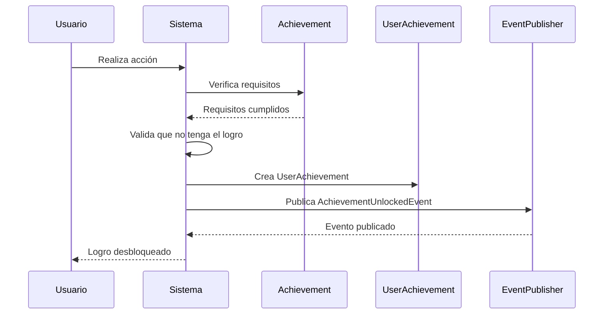
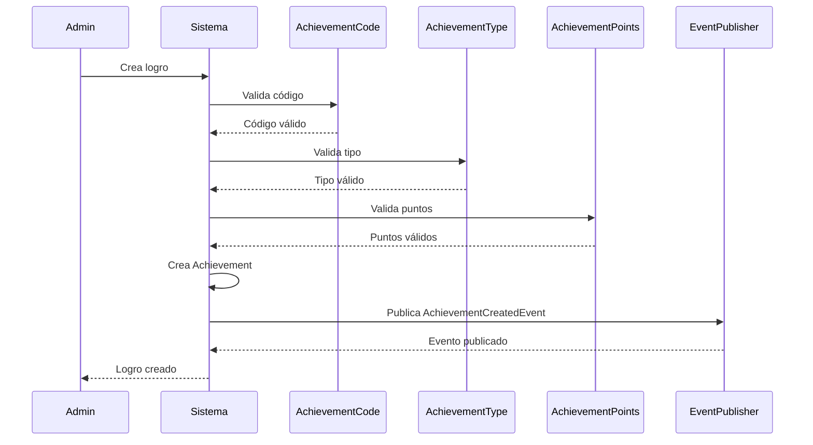

# 🏆 Dominio de Achievement

## Descripción General
El módulo de Achievement implementa el sistema de gamificación de DevMatch, permitiendo a los usuarios desbloquear logros basados en sus actividades en la plataforma. Este dominio encapsula las reglas de negocio relacionadas con logros, su desbloqueo y gestión.

## 🏗️ Modelos de Dominio

### Achievement
**Entidad principal que representa un logro en el catálogo**

#### Características:
- **Identificador único**: Código alfanumérico (ej: `FIRST_PROJECT`)
- **Información descriptiva**: Título, descripción, icono
- **Sistema de puntos**: Puntos que otorga al desbloquearse
- **Categorización**: Tipo de logro para filtrado y organización
- **Estado**: Activo/inactivo, eliminado lógicamente

#### Constructores:
```java
// Crear nuevo logro
new Achievement(code, title, description, points, type, icon)

// Cargar logro existente
new Achievement(id, code, title, description, points, type, icon, 
                isActive, isDeleted, createdAt, updatedAt)
```

#### Métodos de Negocio:
- **`canBeUnlockedBy(userId)`** - Verifica si un usuario puede desbloquear el logro
- **`isRare()`** - Determina si es un logro raro (muchos puntos o tipo veterano)
- **`isCommon()`** - Determina si es un logro común (pocos puntos y básico)
- **`getFullDisplayName()`** - Retorna "Título (X pts)"
- **`isValidForDatabase()`** - Valida coherencia con el DDL

#### Métodos de Categorización:
- **`isBeginnerFriendly()`** - Apto para principiantes
- **`isAdvanced()`** - Nivel avanzado
- **`isSocial()`** - Relacionado con interacción social
- **`isTechnical()`** - Relacionado con habilidades técnicas
- **`isProfileRelated()`** - Relacionado con el perfil
- **`isProjectRelated()`** - Relacionado con proyectos
- **`isReviewRelated()`** - Relacionado con reseñas
- **`isLeadershipRelated()`** - Relacionado con liderazgo
- **`isVeteranRelated()`** - Relacionado con veteranos

#### Métodos de Puntos:
- **`isLowPoints()`** - Puntos bajos (1-25)
- **`isMediumPoints()`** - Puntos medios (26-50)
- **`isHighPoints()`** - Puntos altos (51-100)
- **`isEpicPoints()`** - Puntos épicos (100+)
- **`getPointsTier()`** - Tier de puntos (BRONZE, SILVER, GOLD, etc.)
- **`getDisplayPoints()`** - Puntos formateados para mostrar

### UserAchievement
**Entidad que representa un logro desbloqueado por un usuario**

#### Características:
- **Relación usuario-logro**: Vincula un usuario con un logro específico
- **Timestamp de desbloqueo**: Cuándo se desbloqueó el logro
- **Estado**: Activo/inactivo, eliminado lógicamente

#### Constructores:
```java
// Crear nuevo logro desbloqueado
new UserAchievement(userId, achievementCode)

// Cargar logro desbloqueado existente
new UserAchievement(id, userId, achievementCode, achievedAt, 
                    isActive, isDeleted, createdAt, updatedAt)
```

#### Métodos de Tiempo:
- **`isRecentlyAchieved()`** - Desbloqueado en las últimas 24 horas
- **`isAchievedToday()`** - Desbloqueado hoy
- **`isAchievedThisWeek()`** - Desbloqueado esta semana
- **`isAchievedThisMonth()`** - Desbloqueado este mes
- **`getDaysSinceAchievement()`** - Días desde el desbloqueo
- **`getHoursSinceAchievement()`** - Horas desde el desbloqueo
- **`getTimeAgoDisplay()`** - Tiempo transcurrido formateado

#### Métodos de Negocio:
- **`canBeDisplayed()`** - Puede mostrarse (activo y no eliminado)
- **`isMilestone()`** - Es un hito (fecha especial)

## 🎯 Value Objects

### AchievementCode
**Código único identificador del logro**

#### Validaciones:
- **Longitud**: 3-50 caracteres
- **Formato**: Solo letras mayúsculas y guiones bajos
- **Patrón**: `^[A-Z_]+$`
- **Palabras reservadas**: No permite TEST, EXAMPLE, DUMMY

#### Ejemplos válidos:
- `FIRST_PROJECT`
- `REVIEW_MASTER`
- `COLLABORATION_EXPERT`
- `LEADERSHIP_GURU`

#### Métodos:
- **`getDisplayName()`** - Convierte `FIRST_PROJECT` → `FIRST PROJECT`
- **`isShort()`** - Menos de 15 caracteres
- **`isLong()`** - Más de 30 caracteres
- **`containsUnderscore()`** - Contiene guiones bajos

### AchievementType
**Tipo/categoría del logro**

#### Tipos Predefinidos:
- **`PROFILE`** - Relacionado con el perfil del usuario
- **`PROJECT_CREATION`** - Creación de proyectos
- **`PROJECT_PARTICIPATION`** - Participación en proyectos
- **`PROJECT_APPLICATION`** - Aplicación a proyectos
- **`PROJECT_COMPLETION`** - Finalización de proyectos
- **`REVIEW`** - Reseñas y calificaciones
- **`COLLABORATION`** - Colaboración entre usuarios
- **`LEADERSHIP`** - Liderazgo y gestión
- **`VETERAN`** - Logros para usuarios veteranos
- **`GENERAL`** - Logros generales

#### Validaciones:
- **Longitud**: 3-50 caracteres
- **Formato**: Solo letras mayúsculas y guiones bajos
- **Patrón**: `^[A-Z_]+$`

#### Métodos de Categorización:
- **`isProfileRelated()`** - Relacionado con perfil
- **`isProjectRelated()`** - Relacionado con proyectos
- **`isReviewRelated()`** - Relacionado con reseñas
- **`isLeadershipRelated()`** - Relacionado con liderazgo
- **`isVeteranRelated()`** - Relacionado con veteranos
- **`isBeginnerFriendly()`** - Apto para principiantes
- **`isAdvanced()`** - Nivel avanzado
- **`isSocial()`** - Tipo social
- **`isTechnical()`** - Tipo técnico

#### Métodos de Utilidad:
- **`getDisplayName()`** - Convierte `PROJECT_CREATION` → `PROJECT CREATION`
- **`getCapitalized()`** - Convierte a formato capitalizado
- **`isValidType(type)`** - Valida si un tipo es válido
- **`getSuggestedTypes()`** - Retorna tipos sugeridos

### AchievementPoints
**Puntos que otorga el logro**

#### Tiers de Puntos:
- **BRONZE**: 1-25 puntos
- **SILVER**: 26-50 puntos
- **GOLD**: 51-100 puntos
- **PLATINUM**: 101-200 puntos
- **DIAMOND**: 201+ puntos

#### Métodos:
- **`isLow()`** - Puntos bajos (1-25)
- **`isMedium()`** - Puntos medios (26-50)
- **`isHigh()`** - Puntos altos (51-100)
- **`isEpic()`** - Puntos épicos (100+)
- **`getTier()`** - Tier del logro
- **`getDisplayValue()`** - Puntos formateados

### AchievementTitle
**Título del logro**

#### Validaciones:
- **Longitud**: 3-100 caracteres
- **No vacío**: Debe tener contenido
- **No nulo**: No puede ser null

### AchievementDescription
**Descripción detallada del logro**

#### Validaciones:
- **Longitud**: 10-65535 caracteres (TEXT limit)
- **No vacío**: Debe tener contenido
- **No nulo**: No puede ser null

### AchievementIcon
**URL del icono del logro**

#### Validaciones:
- **Longitud**: Máximo 255 caracteres
- **Formato**: URL válida (opcional)

## 🎉 Eventos de Dominio

### AchievementUnlockedEvent
**Se dispara cuando un usuario desbloquea un logro**

#### Propiedades:
- **`userId`** - ID del usuario que desbloqueó
- **`achievementId`** - ID del logro desbloqueado
- **`achievementCode`** - Código del logro
- **`achievementName`** - Nombre del logro
- **`achievementDescription`** - Descripción del logro

#### Cuándo se dispara:
- Usuario completa una acción que desbloquea un logro
- Sistema detecta que se cumplieron los requisitos
- Administrador otorga logro manualmente

### UserAchievementEarnedEvent
**Se dispara cuando un usuario gana un logro**

#### Propiedades:
- **`userId`** - ID del usuario
- **`achievementCode`** - Código del logro ganado
- **`pointsEarned`** - Puntos ganados
- **`totalPoints`** - Puntos totales del usuario

### AchievementCreatedEvent
**Se dispara cuando se crea un nuevo logro**

#### Propiedades:
- **`achievementId`** - ID del logro creado
- **`achievementCode`** - Código del logro
- **`createdBy`** - ID del administrador que lo creó

### AchievementUpdatedEvent
**Se dispara cuando se actualiza un logro**

#### Propiedades:
- **`achievementId`** - ID del logro actualizado
- **`achievementCode`** - Código del logro
- **`updatedBy`** - ID del administrador que lo actualizó
- **`changes`** - Lista de cambios realizados

### AchievementDeletedEvent
**Se dispara cuando se elimina un logro**

#### Propiedades:
- **`achievementId`** - ID del logro eliminado
- **`achievementCode`** - Código del logro
- **`deletedBy`** - ID del administrador que lo eliminó

### AchievementProgressEvent
**Se dispara cuando hay progreso hacia un logro**

#### Propiedades:
- **`userId`** - ID del usuario
- **`achievementCode`** - Código del logro
- **`progress`** - Progreso actual (0-100)
- **`maxProgress`** - Progreso máximo requerido

## ⚠️ Excepciones de Dominio

### AchievementNotFoundException
**Se lanza cuando no se encuentra un logro**

#### Constructores:
```java
new AchievementNotFoundException(id)        // Por ID
new AchievementNotFoundException(code)      // Por código
```

#### Mensajes:
- `"No se encontró el achievement con ID: {id}"`
- `"No se encontró el achievement con código: {code}"`

### UserAlreadyHasAchievementException
**Se lanza cuando un usuario ya tiene un logro**

#### Constructores:
```java
new UserAlreadyHasAchievementException(userId, achievementId)
new UserAlreadyHasAchievementException(userId, achievementCode)
```

#### Mensajes:
- `"El usuario {userId} ya tiene el achievement {achievementId}"`
- `"El usuario {userId} ya tiene el achievement '{achievementCode}'"`

### AchievementAlreadyExistsException
**Se lanza cuando se intenta crear un logro que ya existe**

#### Constructores:
```java
new AchievementAlreadyExistsException(code)
new AchievementAlreadyExistsException(message)
```

### UserAchievementNotFoundException
**Se lanza cuando no se encuentra un logro de usuario**

#### Constructores:
```java
new UserAchievementNotFoundException(userId, achievementId)
new UserAchievementNotFoundException(message)
```

### AchievementOperationNotAllowedException
**Se lanza cuando una operación no está permitida**

#### Constructores:
```java
new AchievementOperationNotAllowedException(message)
```

## 🔧 Servicios de Dominio

### AchievementDomainService
**Servicio que encapsula lógica de negocio compleja**

#### Métodos de Validación:
- **`canUnlockAchievement(userId, achievement)`** - Verifica si puede desbloquear
- **`isRareAchievement(achievement)`** - Verifica si es raro
- **`isCommonAchievement(achievement)`** - Verifica si es común

#### Métodos de Categorización:
- **`isBeginnerFriendly(achievement)`** - Apto para principiantes
- **`isAdvancedAchievement(achievement)`** - Nivel avanzado
- **`isSocialAchievement(achievement)`** - Tipo social
- **`isTechnicalAchievement(achievement)`** - Tipo técnico
- **`isProfileRelated(achievement)`** - Relacionado con perfil
- **`isProjectRelated(achievement)`** - Relacionado con proyectos
- **`isReviewRelated(achievement)`** - Relacionado con reseñas
- **`isLeadershipRelated(achievement)`** - Relacionado con liderazgo
- **`isVeteranRelated(achievement)`** - Relacionado con veteranos

#### Métodos de Utilidad:
- **`getAchievementTier(achievement)`** - Obtiene el tier
- **`getFullAchievementName(achievement)`** - Nombre completo con puntos

## 📋 Reglas de Negocio

### Reglas de Creación de Logros:
1. **Código único**: No puede existir otro logro con el mismo código
2. **Validación de campos**: Todos los campos obligatorios deben ser válidos
3. **Puntos positivos**: Los puntos deben ser mayores a 0
4. **Tipo válido**: El tipo debe seguir el patrón establecido

### Reglas de Desbloqueo:
1. **Logro activo**: Solo se pueden desbloquear logros activos
2. **No duplicado**: Un usuario no puede tener el mismo logro dos veces
3. **Requisitos cumplidos**: Debe cumplir los requisitos específicos del logro
4. **Usuario válido**: El usuario debe existir y estar activo

### Reglas de Puntos:
1. **Tiers automáticos**: Los tiers se calculan automáticamente según los puntos
2. **Puntos acumulativos**: Los puntos se suman al total del usuario
3. **Validación de rango**: Los puntos deben estar en un rango válido

### Reglas de Tipos:
1. **Tipos predefinidos**: Se recomiendan tipos específicos
2. **Tipos personalizados**: Se permiten tipos nuevos siguiendo el patrón
3. **Categorización automática**: Los tipos se categorizan automáticamente

## 🔄 Flujos de Dominio

### Flujo de Desbloqueo de Logro:


### Flujo de Creación de Logro:


## 🧪 Ejemplos de Uso

### Crear un Logro:
```java
AchievementCode code = new AchievementCode("FIRST_PROJECT");
AchievementTitle title = new AchievementTitle("Primer Proyecto");
AchievementDescription description = new AchievementDescription("Crea tu primer proyecto en DevMatch");
AchievementPoints points = new AchievementPoints(25);
AchievementType type = new AchievementType("PROJECT_CREATION");
AchievementIcon icon = new AchievementIcon("https://example.com/icon.png");

Achievement achievement = new Achievement(code, title, description, points, type, icon);
```

### Desbloquear un Logro:
```java
AchievementCode code = new AchievementCode("FIRST_PROJECT");
UserAchievement userAchievement = new UserAchievement(userId, code);

// Verificar si es reciente
if (userAchievement.isRecentlyAchieved()) {
    System.out.println("¡Logro desbloqueado recientemente!");
}

// Obtener tiempo transcurrido
String timeAgo = userAchievement.getTimeAgoDisplay();
System.out.println("Desbloqueado: " + timeAgo);
```

### Validar un Logro:
```java
AchievementDomainService service = new AchievementDomainService();

// Verificar si puede desbloquear
if (service.canUnlockAchievement(userId, achievement)) {
    // Desbloquear logro
}

// Verificar categorización
if (service.isBeginnerFriendly(achievement)) {
    System.out.println("Logro apto para principiantes");
}

if (service.isRareAchievement(achievement)) {
    System.out.println("¡Logro raro desbloqueado!");
}
```

## 📊 Métricas y Análisis

### Métricas de Logros:
- **Total de logros**: Número total en el catálogo
- **Logros desbloqueados**: Por usuario o globalmente
- **Logros raros**: Porcentaje de logros con alta dificultad
- **Logros comunes**: Porcentaje de logros básicos
- **Distribución por tipo**: Logros por categoría
- **Distribución por puntos**: Logros por tier de puntos

### Métricas de Usuarios:
- **Puntos totales**: Suma de puntos de todos los logros
- **Logros recientes**: Logros desbloqueados en el último mes
- **Progreso**: Progreso hacia logros no desbloqueados
- **Rareza**: Porcentaje de logros raros desbloqueados

## 🔧 Configuración y Personalización

### Tipos de Logros Personalizados:
```java
// Crear tipo personalizado
AchievementType customType = new AchievementType("MOBILE_DEVELOPMENT");

// Verificar si es válido
if (AchievementType.isValidType("AI_SPECIALIST")) {
    // Tipo válido
}

// Obtener tipos sugeridos
String[] suggestedTypes = AchievementType.getSuggestedTypes();
```

### Configuración de Puntos:
```java
// Crear logro con puntos específicos
AchievementPoints points = new AchievementPoints(150); // PLATINUM tier

// Verificar tier
if (points.isEpic()) {
    System.out.println("Logro épico!");
}
```

## 📝 Mejores Prácticas

### Para Desarrolladores:
1. **Usar value objects** - Siempre usar AchievementCode, AchievementType, etc.
2. **Validar antes de crear** - Verificar que no exista el logro
3. **Manejar excepciones** - Capturar y manejar excepciones específicas
4. **Usar servicios de dominio** - Para lógica compleja de validación

### Para Administradores:
1. **Códigos descriptivos** - Usar códigos que describan el logro
2. **Tipos consistentes** - Usar tipos predefinidos cuando sea posible
3. **Puntos balanceados** - Asignar puntos apropiados según la dificultad
4. **Descripciones claras** - Explicar claramente cómo desbloquear el logro

### Para el Sistema:
1. **Eventos de dominio** - Publicar eventos para notificaciones
2. **Validación consistente** - Aplicar las mismas reglas en toda la aplicación
3. **Logging de eventos** - Registrar desbloqueos para análisis
4. **Métricas automáticas** - Calcular métricas automáticamente
